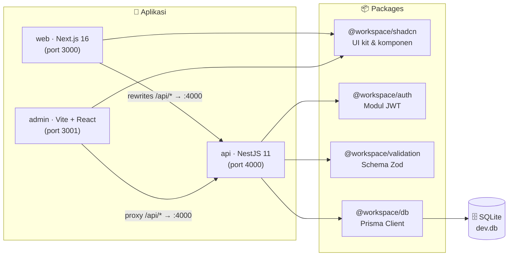
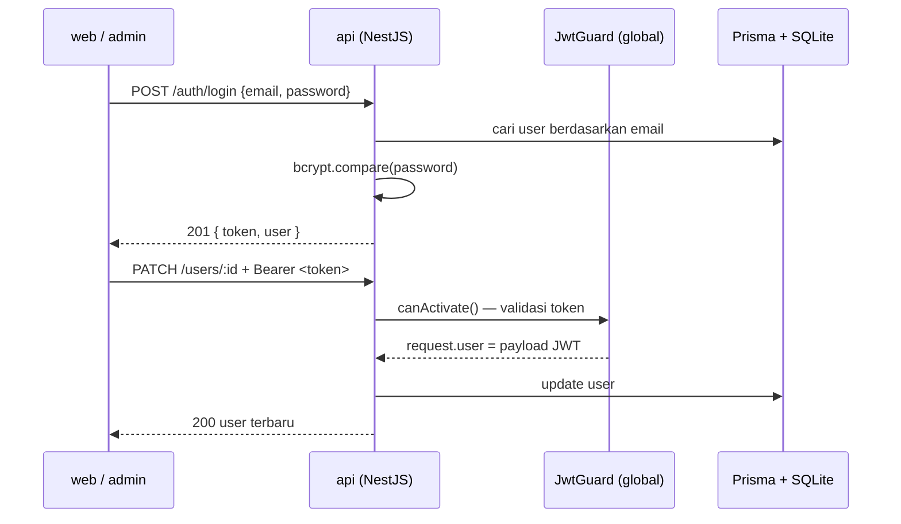

# ⚡ Template Turborepo — Monorepo Full-Stack

Template monorepo full-stack yang siap pakai: **Next.js**, **NestJS**, dan **Vite + React** dalam satu workspace pnpm + Turborepo, dengan **UI kit bersama**, **autentikasi JWT terpusat**, **database SQLite via Prisma**, dan **ratusan test otomatis**.


---

## 📑 Daftar Isi

- [✨ Fitur Utama](#-fitur-utama)
- [🧱 Arsitektur](#-arsitektur)
- [🛠️ Tech Stack](#️-tech-stack)
- [📁 Struktur Repository](#-struktur-repository)
- [🚀 Aplikasi](#-aplikasi)
- [📦 Packages](#-packages)
- [🧪 Testing & Audit](#-testing--audit)
- [⚡ Memulai Cepat](#-memulai-cepat)
- [📜 Scripts](#-scripts)
- [🔐 Environment Variables](#-environment-variables)
- [📚 Dokumentasi Lengkap](#-dokumentasi-lengkap)

---

## ✨ Fitur Utama

- **3 aplikasi dalam satu repo** — `web` (Next.js 16), `admin` (Vite + React Router 7), `api` (NestJS 11) — dijalankan dengan satu perintah: `pnpm dev`.
- **UI kit bersama** — `@workspace/shadcn`: 30+ komponen UI berbasis **Base UI** + **Tailwind CSS v4**, plus komponen kompleks siap pakai (form, tabel, sidebar, halaman login/signup).
- **Autentikasi JWT terpusat** — `@workspace/auth`: modul NestJS reusable (`JwtModule`, `JwtGuard` global, dekorator `@Public` & `@CurrentUser`).
- **Validasi Zod sekali, dipakai di mana-mana** — `@workspace/validation`: schema dibagi antara API (validasi request) dan frontend (validasi form).
- **Database tanpa setup berat** — Prisma 7 + SQLite (`better-sqlite3`) dengan driver adapter, siap jalan tanpa server database.
- **Kualitas teruji otomatis** — **129 test**: 92 test UI (jsdom + Testing Library) dan 37 test keamanan (unit JWT + integrasi langsung ke server dev).
- **Konfigurasi bersama** — `@workspace/config` memusatkan 4 preset ESLint dan 5 tsconfig; konsisten di seluruh workspace.
- **Caching build cerdas** — Turborepo men-cache hasil `build`, `lint`, dan `typecheck`.

---

## 🧱 Arsitektur



**Alur autentikasi secara singkat:**



Diagram dan alur data yang lebih dalam ada di **[`Readme/architecture.md`](Readme/architecture.md)**.

---

## 🛠️ Tech Stack

| Lapisan           | Teknologi                                    | Versi              |
| ----------------- | -------------------------------------------- | ------------------ |
| Manajemen package | pnpm                                         | 10.33.4            |
| Monorepo build    | Turborepo                                    | 2.9.18             |
| Runtime           | Node.js                                      | ≥ 20               |
| App `web`         | Next.js (App Router) + React 19              | 16.2.6 / 19.2.4    |
| App `admin`       | Vite + React 19 + React Router               | 6 / 7.18.2         |
| App `api`         | NestJS                                       | 11.1.28            |
| ORM / database    | Prisma + better-sqlite3 (driver adapter)     | 7.9.1 / 13         |
| UI kit            | Base UI + Tailwind CSS v4 + shadcn           | 1.6.0 / 4 / 4.16   |
| Tabel & kalender  | TanStack Table · react-day-picker · date-fns | 8.21.3 / 10 / 4.4  |
| Validasi          | Zod                                          | 4.4.3              |
| Autentikasi       | jsonwebtoken + bcryptjs                      | 9 / 2.4.3          |
| Testing           | Vitest + jsdom + Testing Library             | 4.1.10 / 30 / 16.3 |
| Kode gaya         | TypeScript 5 · ESLint 9 · Prettier           | —                  |

---

## 📁 Struktur Repository

```
.
├── apps/
│   ├── api/        # 🖥️ NestJS 11 — REST API (port 4000)
│   ├── admin/      # 🎛️ Vite + React — panel admin (port 3001)
│   └── web/        # 🌐 Next.js 16 — website publik (port 3000)
├── packages/
│   ├── auth/       # 🔐 @workspace/auth — modul JWT NestJS reusable
│   ├── db/         # 🗄️ @workspace/db — Prisma client + schema (SQLite)
│   ├── shadcn/     # 🎨 @workspace/shadcn — UI kit & komponen bersama
│   └── validation/ # ✅ @workspace/validation — schema Zod bersama
├── audit/
│   ├── security/   # 🛡️ @workspace/audit-security — 37 test JWT + integrasi
│   └── vitest/     # 🧪 @workspace/audit-vitest — 92 test UI (jsdom)
├── config/         # ⚙️ @workspace/config — preset ESLint & tsconfig
├── scripts/
│   └── github/push # 🚀 git add + commit + push dalam satu perintah
├── turbo.json      # 🌀 Konfigurasi pipeline Turborepo
└── pnpm-workspace.yaml
```

---

## 🚀 Aplikasi

| App         | Framework               | Port | Deskripsi                                                                                                                                                            |
| ----------- | ----------------------- | ---- | -------------------------------------------------------------------------------------------------------------------------------------------------------------------- |
| **`web`**   | Next.js 16 (App Router) | 3000 | Website publik: landing page dengan tabel data user, halaman login/signup, halaman profil. Server component memanggil API langsung; client memakai rewrite `/api/*`. |
| **`admin`** | Vite 6 + React Router 7 | 3001 | Panel admin: layout sidebar, proteksi rute berbasis `localStorage`, dashboard dengan DataTable (view/edit/delete), registrasi user via form dinamis, halaman detail. |
| **`api`**   | NestJS 11               | 4000 | REST API: login JWT, CRUD user, validasi Zod per route, password di-hash bcryptjs (10 rounds), global `JwtGuard`.                                                    |

### Ringkasan Endpoint API

| Metode   | Path          | Proteksi  | Keterangan                             |
| -------- | ------------- | --------- | -------------------------------------- |
| `POST`   | `/auth/login` | 🟢 Publik | Login, mengembalikan `{ token, user }` |
| `POST`   | `/users`      | 🟢 Publik | Registrasi user baru                   |
| `GET`    | `/users`      | 🟢 Publik | Daftar semua user                      |
| `GET`    | `/users/:id`  | 🟢 Publik | Detail user per id                     |
| `PATCH`  | `/users/:id`  | 🔒 JWT    | Update profil user                     |
| `DELETE` | `/users/:id`  | 🔒 JWT    | Hapus user                             |
| `GET`    | `/`           | 🔒 JWT    | Health check + jumlah user             |

Referensi API lengkap (request/response, contoh `curl`, validasi) di **[`Readme/api.md`](Readme/api.md)**.

---

## 📦 Packages

| Package                     | Deskripsi                                                                                                                                                                                                                                                                      |
| --------------------------- | ------------------------------------------------------------------------------------------------------------------------------------------------------------------------------------------------------------------------------------------------------------------------------ |
| **`@workspace/shadcn`**     | UI kit berbasis Base UI + Tailwind v4. **30 komponen UI** (button, dialog, select, sidebar, dsb.), komponen kompleks (`Login`, `Signup`, `DataForm`, `DataTable`), komponen sidebar (`LayoutSide`, `NavMain`, `NavUser`, …), hooks (`use-mobile`), dan lib (`cn`, `apiFetch`). |
| **`@workspace/auth`**       | Modul JWT untuk NestJS: `JwtModule.register()` / `registerAsync()`, `JwtService` (sign/verify), `JwtGuard` global, dekorator `@Public()` & `@CurrentUser()`.                                                                                                                   |
| **`@workspace/db`**         | Prisma 7 client dengan driver adapter `better-sqlite3`, singleton global, model `User` (email unik, password ter-hash, role, status).                                                                                                                                          |
| **`@workspace/validation`** | Schema Zod 4 dibagikan API ↔ frontend: `registerSchema`, `loginSchema`, `updateProfileSchema`, `roleSchema` + tipe hasil infer.                                                                                                                                                |
| **`@workspace/config`**     | 4 preset ESLint (`base`, `nest`, `next-js`, `react-internal`) + 5 tsconfig (`base`, `nest`, `nextjs`, `react-library`, `vite-react`).                                                                                                                                          |

Katalog komponen dan contoh penggunaannya di **[`Readme/components.md`](Readme/components.md)**.

---

## 🧪 Testing & Audit

| Package                     | Jenis                | Lingkungan              | Jumlah                               |
| --------------------------- | -------------------- | ----------------------- | ------------------------------------ |
| `@workspace/audit-vitest`   | Unit UI + lib        | jsdom + Testing Library | **92 test / 28 file**                |
| `@workspace/audit-security` | Unit JWT + integrasi | Node (server dev :4000) | **37 test** (21 unit + 16 integrasi) |

```bash
pnpm test               # semua test (turbo)
pnpm test:ui            # hanya audit-vitest (92 test)
pnpm test:security      # hanya audit-security (37 test)
```

> ⚠️ **Catatan**: test integrasi `audit-security` berkomunikasi langsung dengan API di `http://localhost:4000`. Jalankan `pnpm dev` terlebih dahulu — jika server tidak aktif, test **sengaja gagal dengan pesan yang jelas**, bukan diam-diam di-skip.

Strategi dan detail di **[`Readme/testing.md`](Readme/testing.md)**.

---

## ⚡ Memulai Cepat

### Prasyarat

- **Node.js ≥ 20** (direkomendasikan 22+)
- **pnpm 10** — `corepack enable` lalu `corepack prepare pnpm@10.33.4 --activate` (opsional)

### 1. Install dependencies

```bash
pnpm install
```

### 2. Siapkan environment variables

```bash
cp apps/api/.env.example apps/api/.env   # isi JWT_SECRET dengan secret acak
```

> `DATABASE_URL` bersifat opsional — tanpa di-set, database otomatis memakai `file:./dev.db` di `packages/db`.

### 3. Siapkan database

```bash
pnpm --filter @workspace/db db:generate   # generate Prisma Client
pnpm --filter @workspace/db db:push       # buat tabel dari schema (SQLite)
```

### 4. Jalankan semua aplikasi

```bash
pnpm dev
```

Tunggu beberapa detik, lalu buka:

| App   | URL                                     |
| ----- | --------------------------------------- |
| web   | http://localhost:3000                   |
| admin | http://localhost:3001                   |
| api   | http://localhost:4000 (health: `GET /`) |

---

## 📜 Scripts

| Script               | Deskripsi                                                                |
| -------------------- | ------------------------------------------------------------------------ |
| `pnpm dev`           | Jalankan **semua** app secara bersamaan (web 3000, admin 3001, api 4000) |
| `pnpm build`         | Build semua workspace (dengan cache Turbo)                               |
| `pnpm lint`          | ESLint semua workspace                                                   |
| `pnpm typecheck`     | `tsc --noEmit` semua workspace                                           |
| `pnpm format`        | Prettier — tulis ulang semua file                                        |
| `pnpm test`          | Semua test (UI + security)                                               |
| `pnpm test:ui`       | Hanya `@workspace/audit-vitest`                                          |
| `pnpm test:security` | Hanya `@workspace/audit-security`                                        |
| `pnpm push`          | `git add .` → `git commit` → `git push` dalam satu perintah              |

Script spesifik per app (`next dev`, `nest start`, `vite`, `prisma db push`, dst.) ada di **[`Readme/development.md`](Readme/development.md)**.

### 🚀 Git Workflow — `pnpm push`

Alias untuk `scripts/github/push` — satu perintah untuk `git add .`, commit, dan push:

```bash
pnpm push
```

Perilakunya:

1. Bertanya **satu hal** saja: `Commit message (Enter untuk default):`.
2. Jika pesan **kosong**, dipakai default `commit-<datetime saat push>` (contoh: `commit-2026-08-01 15:11:27`).
3. Lalu `git add .` → `git commit -m "<pesan>"` → `git push` secara berurutan.
4. Jika tidak ada perubahan untuk di-commit, pesan informasi dicetak dan **push tetap dijalankan**.
5. Jika `git add`/`git push` gagal, script berhenti dengan error (tidak dipaksakan lanjut).

---

## 🔐 Environment Variables

| Variable       | Lokasi             | Default                 | Deskripsi                                                   |
| -------------- | ------------------ | ----------------------- | ----------------------------------------------------------- |
| `JWT_SECRET`   | `apps/api/.env`    | — (wajib diisi)         | Secret untuk menandatangani & memverifikasi token JWT       |
| `DATABASE_URL` | `packages/db/.env` | `file:./dev.db`         | Koneksi SQLite untuk Prisma                                 |
| `API_URL`      | env `apps/web`     | `http://localhost:4000` | Base URL API — dipakai rewrite `/api/*` & fetch server-side |
| `NODE_ENV`     | global             | `development`           | Mode lingkungan (dideklarasikan di `turbo.json` globalEnv)  |

> Semua variabel di atas dideklarasikan sebagai `globalEnv` di `turbo.json` agar pipeline Turbo selalu menyadari perubahannya.

---

## 📚 Dokumentasi Lengkap

| Dokumen                                       | Isi                                                                                            |
| --------------------------------------------- | ---------------------------------------------------------------------------------------------- |
| [**architecture.md**](Readme/architecture.md) | Arsitektur mendalam, alur data & autentikasi, ketergantungan antar package, konvensi workspace |
| [**api.md**](Readme/api.md)                   | Referensi API lengkap: endpoint, request/response, validasi, error, contoh `curl`              |
| [**components.md**](Readme/components.md)     | Katalog komponen `@workspace/shadcn` + cara memakainya & menambah komponen baru                |
| [**development.md**](Readme/development.md)   | Panduan pengembangan: script per app, menambah app/package, konfigurasi bersama, database      |
| [**testing.md**](Readme/testing.md)           | Strategi testing, cara menjalankan, dan catatan penting tiap suite                             |

---

## 🧑‍💻 Catatan

- **Bahasa UI**: pesan error API dan label form menggunakan Bahasa Indonesia (mis. _"Token tidak valid atau kedaluwarsa"_, _"Email atau password salah"_).
- **Keamanan (template)**: untuk proyek production, ganti penyimpanan token `localStorage` pada `web`/`admin` dengan cookie `httpOnly` + refresh token, dan gunakan secret yang dirotasi.
- **Next.js versi khusus**: repo ini memakai Next.js 16 dengan API yang dapat berbeda dari versi lain — baca panduan di `node_modules/next/dist/docs/` sebelum mengubah kode.
