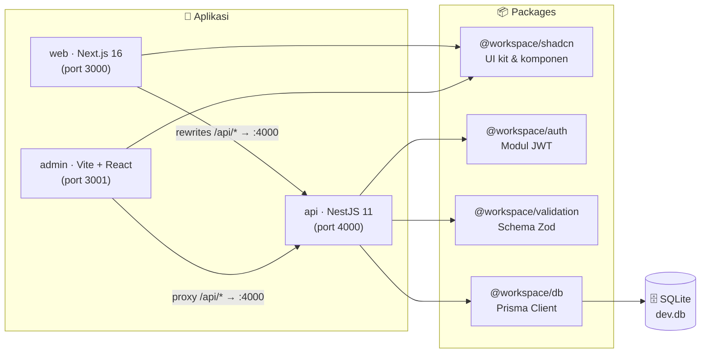
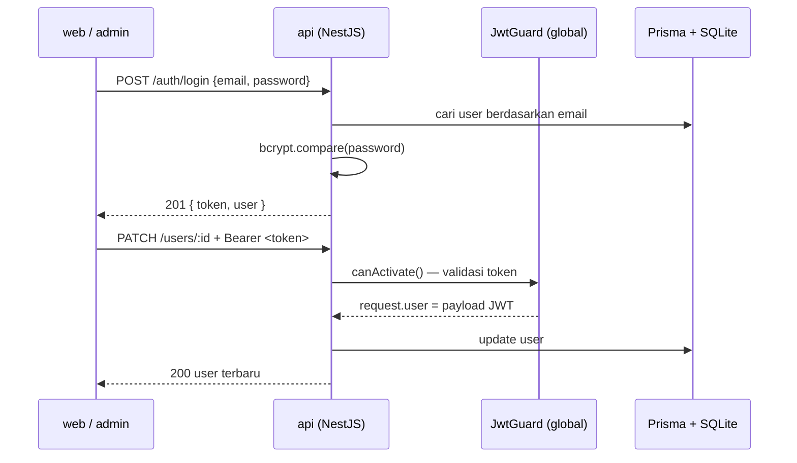

# 📖 Panduan Lengkap — Penggunaan & Setup

Dokumen ini adalah panduan lengkap penggunaan dan setup template Turborepo. `README.md` di root hanya berisi langkah setup awal (ringkas) — semua detail ada di sini.

- **Repositori**: `template-turborepo-01` — monorepo pnpm + Turborepo (Next.js 16, NestJS 11, Vite + React).
- **Paket**: `@workspace/shadcn` (UI kit), `@workspace/auth` (modul JWT), `@workspace/validation` (schema Zod), `@workspace/db` (Prisma — SQLite lokal & PostgreSQL opsional), `@workspace/config` (preset ESLint & tsconfig).
- **Setup otomatis**: `pnpm bootstrap` (lihat bagian [Setup Cepat](#-setup-cepat)).

---

## ⚡ Setup Cepat

### Prasyarat

- **Node.js ≥ 20** (direkomendasikan 22+)
- **pnpm 10** — `corepack enable` lalu `corepack prepare pnpm@10.33.4 --activate` (opsional)

### Cara clone & jalankan

```bash
git clone <url-repo> && cd template-turborepo-01
corepack enable      # pnpm 10.33.4 otomatis terpin (packageManager di package.json)

pnpm bootstrap           # siapkan .env, install deps, generate & buat tabel database
pnpm dev             # web :3000 · admin :3001 · api :4000
```

### Apa yang dilakukan `pnpm bootstrap` (idempotent — aman dijalankan ulang)

1. **Environment files**
   - `apps/api/.env` — dibuat dari `.env.example`; `JWT_SECRET` di-generate acak.
   - `packages/db/.env` — dibuat dari `.env.example`; `DATABASE_URL_PGSQL` **kosong** (mode SQLite lokal).
   - File yang sudah ada **tidak ditimpa**.
2. `pnpm install` — install semua dependencies (reproducible via `pnpm-lock.yaml`).
3. `pnpm --filter @workspace/db db:generate` — generate Prisma Client.
4. `pnpm --filter @workspace/db db:push` — buat tabel di SQLite lokal (`packages/db/prisma/dev.db`).

### Setup manual (tanpa script)

```bash
pnpm install
cp apps/api/.env.example apps/api/.env   # isi JWT_SECRET dengan nilai acak
cp packages/db/.env.example packages/db/.env
pnpm --filter @workspace/db db:generate
pnpm --filter @workspace/db db:push
```

> `DATABASE_URL` opsional — tanpa di-set, SQLite otomatis memakai `file:./dev.db` di `packages/db`.

### Opsional setelah setup

```bash
pnpm sqlite seed User   # isi akun contoh: admin / admin@admin.com / admin1234 (role admin)
                        #                    user  / user@user.com  / user1234  (role user)
pnpm test               # jalankan semua test
```

---

## 🧱 Arsitektur



**Alur autentikasi secara singkat:**



Diagram dan alur data yang lebih dalam di **[`architecture.md`](architecture.md)**.

---

## 🛠️ Tech Stack

| Lapisan           | Teknologi                                           | Versi              |
| ----------------- | --------------------------------------------------- | ------------------ |
| Manajemen package | pnpm                                                | 10.33.4            |
| Monorepo build    | Turborepo                                           | 2.9.18             |
| Runtime           | Node.js                                             | ≥ 20               |
| App `web`         | Next.js (App Router) + React 19                     | 16.2.6 / 19.2.4    |
| App `admin`       | Vite + React 19 + React Router                      | 6 / 7.18.2         |
| App `api`         | NestJS                                              | 11.1.28            |
| ORM / database    | Prisma + better-sqlite3 (lokal) / + pg (PostgreSQL) | 7.9.1 / 13 / 8     |
| UI kit            | Base UI + Tailwind CSS v4 + shadcn                  | 1.6.0 / 4 / 4.16   |
| Tabel & kalender  | TanStack Table · react-day-picker · date-fns        | 8.21.3 / 10 / 4.4  |
| Validasi          | Zod                                                 | 4.4.3              |
| Autentikasi       | jsonwebtoken + bcryptjs                             | 9 / 2.4.3          |
| Testing           | Vitest + jsdom + Testing Library                    | 4.1.10 / 30 / 16.3 |
| Kode gaya         | TypeScript 5 · ESLint 9 · Prettier                  | —                  |

---

## 📁 Struktur Repository

```
.
├── apps/
│   ├── api/        # 🖥️ NestJS 11 — REST API (port 4000)
│   ├── admin/      # 🎛️ Vite + React — panel admin (port 3001)
│   └── web/        # 🌐 Next.js 16 — website publik (port 3000)
├── packages/
│   ├── auth/       # 🔐 @workspace/auth — modul JWT NestJS reusable
│   ├── db/         # 🗄️ @workspace/db — Prisma client + schema (SQLite & PostgreSQL)
│   ├── shadcn/     # 🎨 @workspace/shadcn — UI kit & komponen bersama
│   └── validation/ # ✅ @workspace/validation — schema Zod bersama
├── audit/
│   ├── security/   # 🛡️ @workspace/audit-security — 37 test JWT + integrasi
│   └── vitest/     # 🧪 @workspace/audit-vitest — 92 test UI (jsdom)
├── config/         # ⚙️ @workspace/config — preset ESLint & tsconfig
├── scripts/
│   ├── workspace-clone/    # ⚙️ Setup & tooling pasca-clone
│   │   ├── bootstrap       #     pnpm bootstrap — setup otomatis (env, install, db)
│   │   ├── rename          #     pnpm rename <nama> — ganti nama proyek
│   │   └── templates/      #     Template README.md yang ditulis bootstrap
│   ├── workspace-db/       # 🗄️ CLI data: pnpm sqlite / pnpm pgsql (push, delete, seed, tables)
│   │   └── db-ops.js
│   └── github/push         # 🚀 git add + commit + push + catat ke commit.md
├── commit.md       # 📝 Catatan commit otomatis (datetime, commit, type, file list)
├── turbo.json      # 🌀 Konfigurasi pipeline Turborepo
└── pnpm-workspace.yaml
```

---

## 🚀 Aplikasi

| App         | Framework               | Port | Deskripsi                                                                                                                                                            |
| ----------- | ----------------------- | ---- | -------------------------------------------------------------------------------------------------------------------------------------------------------------------- |
| **`web`**   | Next.js 16 (App Router) | 3000 | Website publik: landing page dengan tabel data user, halaman login/signup, halaman profil. Server component memanggil API langsung; client memakai rewrite `/api/*`. |
| **`admin`** | Vite 6 + React Router 7 | 3001 | Panel admin: layout sidebar, proteksi rute berbasis `localStorage`, dashboard dengan DataTable (view/edit/delete), registrasi user via form dinamis, halaman detail. |
| **`api`**   | NestJS 11               | 4000 | REST API: login JWT, CRUD user, validasi Zod per route, password di-hash bcryptjs (10 rounds), global `JwtGuard`.                                                    |

### Ringkasan Endpoint API

| Metode   | Path          | Proteksi  | Keterangan                             |
| -------- | ------------- | --------- | -------------------------------------- |
| `POST`   | `/auth/login` | 🟢 Publik | Login, mengembalikan `{ token, user }` |
| `POST`   | `/users`      | 🟢 Publik | Registrasi user baru                   |
| `GET`    | `/users`      | 🟢 Publik | Daftar semua user                      |
| `GET`    | `/users/:id`  | 🟢 Publik | Detail user per id                     |
| `PATCH`  | `/users/:id`  | 🔒 JWT    | Update profil user                     |
| `DELETE` | `/users/:id`  | 🔒 JWT    | Hapus user                             |
| `GET`    | `/`           | 🔒 JWT    | Health check + jumlah user             |

Referensi API lengkap (request/response, contoh `curl`, validasi) di **[`api.md`](api.md)**.

---

## 📦 Packages

| Package                     | Deskripsi                                                                                                                                                                                                                                                                      |
| --------------------------- | ------------------------------------------------------------------------------------------------------------------------------------------------------------------------------------------------------------------------------------------------------------------------------ |
| **`@workspace/shadcn`**     | UI kit berbasis Base UI + Tailwind v4. **30 komponen UI** (button, dialog, select, sidebar, dsb.), komponen kompleks (`Login`, `Signup`, `DataForm`, `DataTable`), komponen sidebar (`LayoutSide`, `NavMain`, `NavUser`, …), hooks (`use-mobile`), dan lib (`cn`, `apiFetch`). |
| **`@workspace/auth`**       | Modul JWT untuk NestJS: `JwtModule.register()` / `registerAsync()`, `JwtService` (sign/verify), `JwtGuard` global, dekorator `@Public()` & `@CurrentUser()`.                                                                                                                   |
| **`@workspace/db`**         | **Dua setup database**: Prisma SQLite (default, `DATABASE_URL`) dan Prisma PostgreSQL (`DATABASE_URL_PGSQL`); model `User` (email unik, password ter-hash, role, status). API otomatis memakai PostgreSQL saat env pgsql terisi (deploy Vercel) dan SQLite di localhost.       |
| **`@workspace/validation`** | Schema Zod 4 dibagikan API ↔ frontend: `registerSchema`, `loginSchema`, `updateProfileSchema`, `roleSchema` + tipe hasil infer.                                                                                                                                                |
| **`@workspace/config`**     | 4 preset ESLint (`base`, `nest`, `next-js`, `react-internal`) + 5 tsconfig (`base`, `nest`, `nextjs`, `react-library`, `vite-react`).                                                                                                                                          |

Katalog komponen dan contoh penggunaannya di **[`components.md`](components.md)**.

---

## 🧪 Testing & Audit

| Package                     | Jenis                | Lingkungan              | Jumlah                               |
| --------------------------- | -------------------- | ----------------------- | ------------------------------------ |
| `@workspace/audit-vitest`   | Unit UI + lib        | jsdom + Testing Library | **92 test / 28 file**                |
| `@workspace/audit-security` | Unit JWT + integrasi | Node (server dev :4000) | **37 test** (21 unit + 16 integrasi) |

```bash
pnpm test               # semua test (turbo)
pnpm test:ui            # hanya audit-vitest (92 test)
pnpm test:security      # hanya audit-security (37 test)
```

> ⚠️ **Catatan**: test integrasi `audit-security` berkomunikasi langsung dengan API di `http://localhost:4000`. Jalankan `pnpm dev` terlebih dahulu — jika server tidak aktif, test **sengaja gagal dengan pesan yang jelas**, bukan diam-diam di-skip.

Strategi dan detail di **[`testing.md`](testing.md)**.

---

## 📜 Scripts

| Script               | Deskripsi                                                                |
| -------------------- | ------------------------------------------------------------------------ |
| `pnpm bootstrap`     | Setup awal pasca-clone (env, install, database) — idempotent             |
| `pnpm dev`           | Jalankan **semua** app secara bersamaan (web 3000, admin 3001, api 4000) |
| `pnpm build`         | Build semua workspace (dengan cache Turbo)                               |
| `pnpm lint`          | ESLint semua workspace                                                   |
| `pnpm typecheck`     | `tsc --noEmit` semua workspace                                           |
| `pnpm format`        | Prettier — tulis ulang semua file                                        |
| `pnpm test`          | Semua test (UI + security)                                               |
| `pnpm test:ui`       | Hanya `@workspace/audit-vitest`                                          |
| `pnpm test:security` | Hanya `@workspace/audit-security`                                        |
| `pnpm push`          | `git add .` → commit → push + catat ke tabel `commit.md` (type: add/fix/update) |

Script spesifik per app (`next dev`, `nest start`, `vite`, `prisma db push`, dst.) ada di **[`development.md`](development.md)**.

### 🚀 Git Workflow — `pnpm push`

Alias untuk `scripts/github/push` — satu perintah untuk `git add .`, commit, dan push. Setiap push juga **mencatat commit ke tabel di `commit.md`** (kolom: `datetime`, `commit`, `type`, `file list`):

```bash
pnpm push
```

Perilakunya:

1. Bertanya **satu hal** saja: `Commit message (Enter untuk default):`.
2. Jika pesan **kosong**, dipakai default `commit-<datetime saat push>`.
3. Lalu `git add .` → `git commit -m "<pesan>"` → `git push` secara berurutan.
4. Jika tidak ada perubahan untuk di-commit, pesan informasi dicetak dan **push tetap dijalankan**.
5. Jika `git add`/`git push` gagal, script berhenti dengan error (tidak dipaksakan lanjut).

---

## 🗄️ Utilitas Data CLI — `pnpm sqlite` / `pnpm pgsql`

Manipulasi data langsung dari terminal (script: `scripts/workspace-db/db-ops.js`). Menulis ke SQLite lokal (`dev.db`) atau PostgreSQL (`packages/db/.env` → `DATABASE_URL_PGSQL`). Nama tabel dikenali dari model **dan** nama tabel database (`users`/`Users`/`User` → model `User`).

| Perintah                                                           | Fungsi                                                                     |
| ------------------------------------------------------------------ | -------------------------------------------------------------------------- |
| `pnpm sqlite tables` / `pnpm pgsql tables`                         | Daftar tabel                                                               |
| `pnpm sqlite push table`                                           | Pilih tabel lalu isi data (interaktif)                                     |
| `pnpm sqlite push table users`                                     | Isi data ke tabel `User` — prompt per kolom; kolom ber-`@default` otomatis |
| `pnpm sqlite push table users email=a@b.co role=user`              | Non-interaktif via argumen `key=value` (bisa dicampur)                     |
| `pnpm pgsql push table users email=a@b.co role=user`               | Sama, ke PostgreSQL                                                        |
| `pnpm sqlite seed User` / `pnpm pgsql seed User`                   | Isi data seed tabel `User` (upsert by email — idempotent)                  |
| `pnpm sqlite delete table users` / `pnpm pgsql delete table users` | Hapus **isi** tabel (semua baris), tabel tetap ada                         |
| `pnpm sqlite delete` / `pnpm pgsql delete`                         | **Drop SEMUA tabel** + data — konfirmasi ketik `HAPUS SEMUA`               |

Catatan:

- Field `password` otomatis di-hash `bcrypt` (sesuai `apps/api`), jadi user hasil `push`/`seed` bisa langsung login.
- Data seed (tabel `User`): `admin`/`admin@admin.com`/`admin1234` (role `admin`) dan `user`/`user@user.com`/`user1234` (role `user`) — definisi di `SEEDS` pada `scripts/workspace-db/db-ops.js`.
- Setelah `delete` (drop semua), schema hilang — restore dengan `db:push` / `db:push:pgsql`.
- Prasyarat: `@workspace/db` sudah di-build (`pnpm --filter @workspace/db build`).

---

## 🔐 Environment Variables

| Variable             | Lokasi                   | Default                 | Deskripsi                                                                                                                                               |
| -------------------- | ------------------------ | ----------------------- | ------------------------------------------------------------------------------------------------------------------------------------------------------- |
| `JWT_SECRET`         | `apps/api/.env`          | — (wajib diisi)         | Secret untuk menandatangani & memverifikasi token JWT — `pnpm bootstrap` meng-generate otomatis                                                         |
| `DATABASE_URL`       | `packages/db/.env`       | `file:./dev.db`         | Koneksi SQLite untuk Prisma (mode lokal)                                                                                                                |
| `DATABASE_URL_PGSQL` | env deploy (mis. Vercel) | — (kosong)              | Koneksi PostgreSQL — alternatif: `POSTGRES_URL` / `PRISMA_DATABASE_URL` (nama .env.local Vercel). Saat salah satu terisi, API otomatis memakai Postgres |
| `API_URL`            | env `apps/web`           | `http://localhost:4000` | Base URL API — dipakai rewrite `/api/*` & fetch server-side                                                                                             |
| `NODE_ENV`           | global                   | `development`           | Mode lingkungan (dideklarasikan di `turbo.json` globalEnv)                                                                                              |

> Semua variabel di atas dideklarasikan sebagai `globalEnv` di `turbo.json` agar pipeline Turbo selalu menyadari perubahannya.

### PostgreSQL (opsional) — mis. Prisma Postgres di Vercel

1. Isi `DATABASE_URL_PGSQL` di `packages/db/.env` (atau set `POSTGRES_URL` / `PRISMA_DATABASE_URL` di env deploy). Prioritas yang dikenali: `DATABASE_URL_PGSQL > POSTGRES_URL > PRISMA_DATABASE_URL`.
2. Generate & sinkronkan schema pgsql:

   ```bash
   pnpm --filter @workspace/db db:generate:pgsql
   pnpm --filter @workspace/db db:push:pgsql
   ```

3. API otomatis beralih ke Postgres saat salah satu env di atas terisi (lokal tetap SQLite). Periksa log API: `DB PostgreSQL Berhasil` / `DB Sqlite Berhasil`.

> **Prisma Postgres**: `db.prisma.io` = koneksi _direct_ (pas untuk `db push`/Studio); untuk traffic aplikasi produksi gunakan string _pooled_ (`pooled.db.prisma.io`). Jangan menimpa `DATABASE_URL` — itu khusus SQLite lokal.

---

## 📚 Dokumentasi Lanjutan

| Dokumen                                | Isi                                                                                            |
| -------------------------------------- | ---------------------------------------------------------------------------------------------- |
| [**architecture.md**](architecture.md) | Arsitektur mendalam, alur data & autentikasi, ketergantungan antar package, konvensi workspace |
| [**api.md**](api.md)                   | Referensi API lengkap: endpoint, request/response, validasi, error, contoh `curl`              |
| [**components.md**](components.md)     | Katalog komponen `@workspace/shadcn` + cara memakainya & menambah komponen baru                |
| [**development.md**](development.md)   | Panduan pengembangan: script per app, menambah app/package, konfigurasi bersama, database      |
| [**testing.md**](testing.md)           | Strategi testing, cara menjalankan, dan catatan penting tiap suite                             |

---

## 🧑‍💻 Catatan

- **Bahasa UI**: pesan error API dan label form menggunakan Bahasa Indonesia (mis. _"Token tidak valid atau kedaluwarsa"_, _"Email atau password salah"_).
- **Keamanan (template)**: untuk proyek production, ganti penyimpanan token `localStorage` pada `web`/`admin` dengan cookie `httpOnly` + refresh token, dan gunakan secret yang dirotasi.
- **Next.js versi khusus**: repo ini memakai Next.js 16 dengan API yang dapat berbeda dari versi lain — baca panduan di `node_modules/next/dist/docs/` sebelum mengubah kode.
